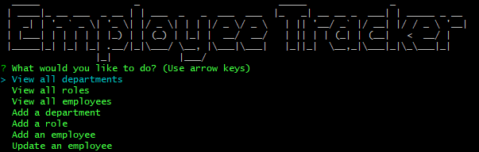

### Employee Tracker

### Description 
The Employee Tracker is an node based command line application that acts as content management system (CMS). The content, as the name suggests, are a list of employees with various departments, titles, and salaries. A MySQL database is used to store the information.

### Usage
In order to use the application, the user must first connect and seed the database. To connect, create a 'config' directory within the root. Once created, add a config.js file that containts the following: 

    const mysql = require('mysql2');

    // create SQL connection 
    const db = mysql.createConnection(
        {
            host: <enter host>, 
            user: <enter username>, 
            password: <enter password>,
            database: 'employee_tracker'
        }
    )

    module.exports = db;

The DB setup can be done by heading to the root directory, launching the MySQL CLI and running the following:

    Source db/db.sql;
    USE employee_tracker;
    Source db/schema.sql;
    Source db/seeds.sql;

Once complete, the user can begin installing the required dependencies and finally, running:

    node app

A video of the various functions can be seen [here](https://watch.screencastify.com/v/nWwbZRZQawIE4t4CK3YK)

